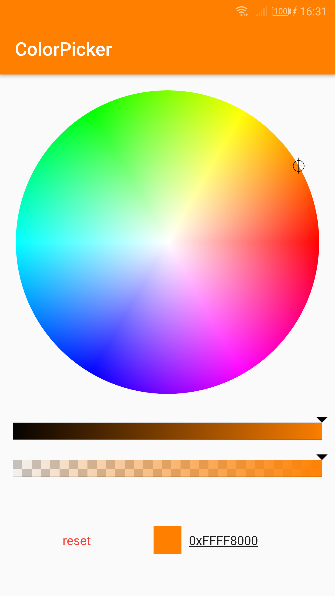
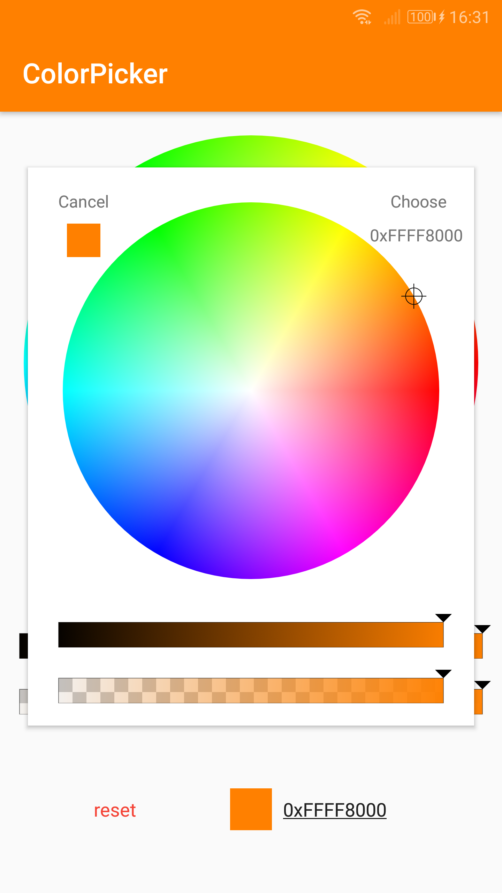
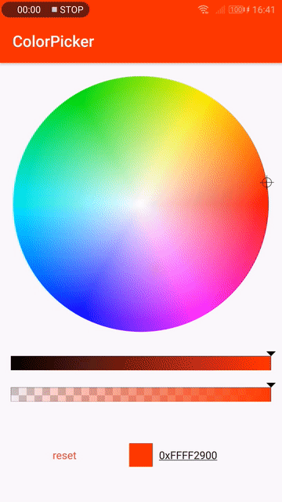

# ColorPicker [](https://github.com/duanhong169/ColorPicker/releases) [](https://developer.android.com/index.html) [](https://android-arsenal.com/details/1/7068) <a target="_blank" href="https://android-arsenal.com/api?level=14"></a> [](https://github.com/duanhong169/ColorPicker/blob/master/LICENSE)

English | [中文](README_cn.md)

A `ColorPicker` for Android. Pick a color using color wheel and slider (HSV & alpha).

  

## Gradle

```
dependencies {
    implementation 'com.github.duanhong169:colorpicker:${latestVersion}'
    ...
}
```

> Replace `${latestVersion}` with the latest version code. See [releases](https://github.com/duanhong169/ColorPicker/releases).

## Usage

### Using `ColorPickerPopup`

```java
new ColorPickerPopup.Builder(this)
        .initialColor(Color.RED) // Set initial color
        .enableAlpha(true) // Enable alpha slider or not
        .okTitle("Choose")
        .cancelTitle("Cancel")
        .showIndicator(true)
        .showValue(true)
        .build()
        .show(v, new ColorPickerPopup.ColorPickerObserver() {
            @Override
            public void onColorPicked(int color) {
                v.setBackgroundColor(color);
            }

            @Override
            public void onColor(int color, boolean fromUser) {

            }
        });
```

### Using `ColorPickerView`

* Add `ColorPickerView` into your layout xml:

```xml
<top.defaults.view.ColorPickerView
    android:id="@+id/colorPicker"
    android:layout_width="0dp"
    android:layout_height="wrap_content"
    app:enableAlpha="true"
    app:layout_constraintLeft_toLeftOf="parent"
    app:layout_constraintRight_toRightOf="parent"
    app:layout_constraintTop_toTopOf="parent"/>
```

> See [`top_defaults_view_color_picker_attrs.xml`](./colorpicker/src/main/res/values/top_defaults_view_color_picker_attrs.xml) for all supported attributes.

* Implement `ColorObserver` and subscribe to `ColorPickerView` to receive color updates from the `ColorPickerView`:

```java
colorPickerView.subscribe((color, fromUser) -> {
    // use the color
});
```

* Set initial color:

```java
colorPickerView.setInitialColor(0x7F313C93);
```

* Reset to initial color:

```java
colorPickerView.reset();
```

See a complete usage in the app sample code.

## License

    Copyright 2018 Hong Duan

    Licensed under the Apache License, Version 2.0 (the "License");
    you may not use this file except in compliance with the License.
    You may obtain a copy of the License at

        http://www.apache.org/licenses/LICENSE-2.0

    Unless required by applicable law or agreed to in writing, software
    distributed under the License is distributed on an "AS IS" BASIS,
    WITHOUT WARRANTIES OR CONDITIONS OF ANY KIND, either express or implied.
    See the License for the specific language governing permissions and
    limitations under the License.